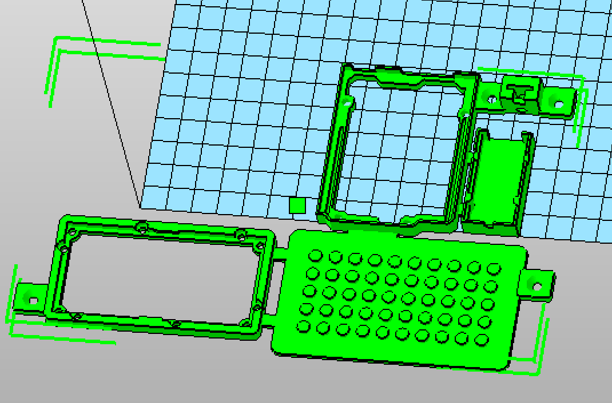

# Grove-NeoPixel-Multiboard

## General Infos

Arduino Grove NeoPixel Multiboard (4x NeoPixel)

### Hardware Image


> [!TIP]
> You need a external power supply for a higher quantity of neoPixel

Code for handling 4 different digital Pins for NeoPixel Control

> Used the source from adafruit.com

## Main Definition

```
Adafruit_NeoPixel stripNeoPixel0 = Adafruit_NeoPixel(NUM_NEO_PIXEL0, NEOPIN0, NEO_RGB  + NEO_KHZ800); // 10er
Adafruit_NeoPixel stripNeoPixel1 = Adafruit_NeoPixel(NUM_NEO_PIXEL1, NEOPIN1, NEO_RGB  + NEO_KHZ800); // stripe
Adafruit_NeoPixel stripNeoPixel2 = Adafruit_NeoPixel(NUM_NEO_PIXEL2, NEOPIN2, NEO_RGB  + NEO_KHZ800); // flower - 20er Ring
Adafruit_NeoPixel stripNeoPixel3 = Adafruit_NeoPixel(NUM_NEO_PIXEL3, NEOPIN3, NEO_RGB  + NEO_KHZ800); // button strand single
```

## Usage for ALL NeoPixel

```
int neoPixelAll() {
  int counter = 0;
  for(int i=0; i<NUMSTRIPS; i++)
    counter += stripArray[i].numPixels(); 
  return counter;
}
```


## Grove Hardware

Used Hardware: 

* Arduino Uno // Grove **Lotus** :+1:
  *  [Seeeduino Lotus](https://www.seeedstudio.com/Seeeduino-Lotus-V1-1-ATMega328-Board-with-Grove-Interface.html) 
* NeoPixel 4 Types
  * Ring https://www.seeedstudio.com/Grove-RGB-LED-Ring-16-WS2813-Mini-p-4201.html
  * Stick https://www.seeedstudio.com/Grove-RGB-LED-Stick-15-WS2813-Mini-p-4270.html 
  * Stripe https://www.seeedstudio.com/Digital-RGB-LED-Flexi-Strip-60-LED-1-Meter-p-1666.html 
  * Button (with one NeoPixel) https://www.seeedstudio.com/Grove-Chainable-RGB-LED.html 
* PowerSupply XP Power 5V 10A LCS50US05 https://www.mouser.at/ProductDetail/XP-Power/LCS50US05
* RGB LCD Screen https://www.seeedstudio.com/Grove-LCD-RGB-Backlight.html
* Grove - Yellow LED Button (SKU 111020045) https://www.seeedstudio.com/Grove-Yellow-LED-Button.html 

### STL Grove Holder with "Lego connectors"



> [!TIP]
> Use a woodbase for fixing the printed grove holder


